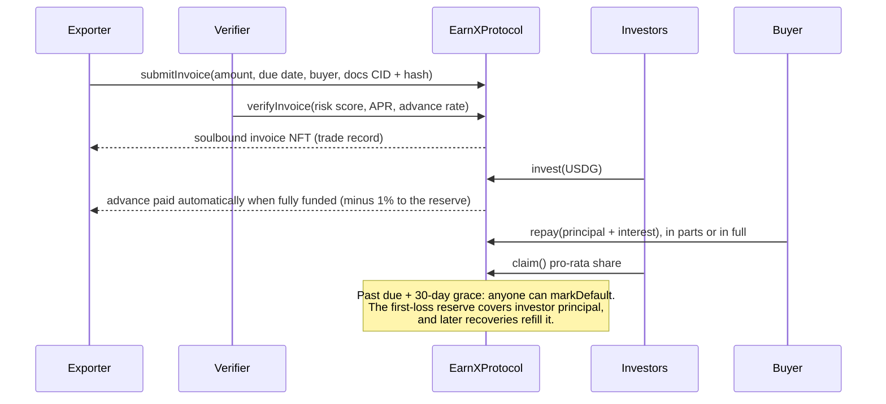

# EarnX

**Get paid when you ship, not when your buyer pays.**

EarnX turns a verified export invoice into cash for an African exporter today. Investors anywhere fund it in **Paxos USDG** (or Circle USDC) and earn the yield when the buyer pays. Everything that moves money is enforced by smart contracts on **Robinhood Chain** and **Arbitrum**.

**[Live app → earnx-app.vercel.app](https://earnx-app.vercel.app)** · [Contracts](contracts/) · [Robinhood Chain protocol](https://explorer.testnet.chain.robinhood.com/address/0xA7fC55ca10c05aA2a0e0Cef5e00f15B08Caf4a99) · [Arbitrum Sepolia protocol](https://arbitrum-sepolia.blockscout.com/address/0x0D0C0eE2a93D4E6d912da43810Ca8f327BDc7341)

---

## The problem

A confirmed export order is not cash. An exporter pays farmers, processors and freight up front, then waits weeks or months for the buyer to pay. Banks rarely lend against those invoices, so good orders are turned down, or sold to middlemen at a discount.

- **$74–92 billion** of trade finance requested by African businesses went unmet in 2024 ([African Development Bank](https://www.gtreview.com/news/africa/africas-trade-finance-gap-tops-us74bn-as-banks-retreat-afdb-warns/)).
- **37%** of trade finance applications from African firms were rejected between 2020 and 2024 (same source).
- Africa's factoring market was about **€50 billion** in 2024; Afreximbank estimates it must reach **€240 billion** to close the SME gap ([Afreximbank via GTR](https://www.gtreview.com/news/africa/factoring-volumes-must-reach-e240bn-to-close-sme-financing-gap-afreximbank-says/)).

<!-- Founder story section: added when written. -->

## What EarnX does

**For exporters**
- Sign in with a fingerprint or Face ID (a passkey smart account). No wallet app, no seed phrase, and network fees are sponsored.
- Upload the invoice and shipping documents. They go to IPFS; their fingerprint goes on-chain.
- Once verified and fully funded, up to 90% of the invoice lands in your account **in the same transaction**.
- Every verified invoice mints a **non-transferable record** to you: an on-chain trade history that belongs to you, not to a bank's filing cabinet.

**For investors**
- Browse real invoices with their terms, risk score and documents, without connecting a wallet.
- Fund any amount from 1 USDG. When the buyer pays, claim your share of principal plus yield.
- Check for yourself that an invoice's documents still match what the verifier reviewed: the app hashes them in your browser and compares with the chain.

## How it works



**What keeps it honest**
- **Short and self-liquidating.** Each advance is tied to one shipment and repaid when that buyer pays. Terms are capped at 365 days on-chain.
- **First-loss reserve.** 1% of every advance, plus any capital partners add, covers investor principal before investors lose anything. It can only be used for that.
- **Documents you can check.** Each invoice stores the keccak256 of a manifest listing every document and its own hash. A verifier signature is bound to that exact hash.
- **No hidden levers.** The admin can pause new activity and allow-list stablecoins. It cannot move investor funds.

## Try it

1. Open **[earnx-app.vercel.app](https://earnx-app.vercel.app)** and pick a network (Robinhood Chain or Arbitrum).
2. Browse **Invest**. Invoices marked *sample* are fictional and seeded for the demo; invoice #6 on each chain has already gone through the whole cycle to **Repaid**.
3. To fund one, get testnet ETH ([Robinhood](https://faucet.testnet.chain.robinhood.com), [Arbitrum](https://arbitrum.faucet.dev)) and test [USDG](https://faucet.paxos.com) or [USDC](https://faucet.circle.com), connect a wallet and invest from 1 USDG.
4. To see the exporter side, go to **Get paid early**, sign in with a passkey or wallet, upload a PDF and submit. The automated pre-screen checks the documents and opens the invoice for funding within seconds.

## Deployments

| Network | EarnXProtocol | EarnXInvoiceNFT | Settlement |
|---|---|---|---|
| Robinhood Chain testnet (46630) | [`0xA7fC55ca10c05aA2a0e0Cef5e00f15B08Caf4a99`](https://explorer.testnet.chain.robinhood.com/address/0xA7fC55ca10c05aA2a0e0Cef5e00f15B08Caf4a99) | [`0x7c2e27323578C67B4c2E847024D80091586503d6`](https://explorer.testnet.chain.robinhood.com/address/0x7c2e27323578C67B4c2E847024D80091586503d6) | Paxos USDG |
| Arbitrum Sepolia (421614) | [`0x0D0C0eE2a93D4E6d912da43810Ca8f327BDc7341`](https://arbitrum-sepolia.blockscout.com/address/0x0D0C0eE2a93D4E6d912da43810Ca8f327BDc7341) | [`0xc9A10EDA07ea8D90dB95254540efb7F00907f888`](https://arbitrum-sepolia.blockscout.com/address/0xc9A10EDA07ea8D90dB95254540efb7F00907f888) | Paxos USDG, Circle USDC |

All contracts are source-verified on Blockscout.

## Architecture

| Part | What it is |
|---|---|
| [`contracts/`](contracts/) | Foundry project. `EarnXProtocol` (lifecycle, pricing, reserve) and `EarnXInvoiceNFT` (ERC-5192 soulbound records with on-chain SVG metadata). OpenZeppelin 5.7: AccessControl, SafeERC20, ReentrancyGuard, Pausable, EIP-712, Nonces. 29 tests including fuzz tests; CI on every push. |
| [`app/`](app/) | Vite + React + TypeScript, wagmi + RainbowKit for wallets, ZeroDev Kernel v3.1 for passkey accounts with sponsored gas, Tailwind. ABIs and addresses are generated from `contracts/` so the app cannot drift from the chain. |
| [`app/api/upload`](app/api/upload.ts) | Serverless function that pins documents to IPFS through Pinata and returns the manifest CID and hash. The Pinata key never reaches the browser. |
| [`app/api/verify`](app/api/verify.ts) | Automated pre-screen for the testnet: re-fetches the documents from IPFS, checks them against the on-chain hash, applies published rules, and verifies or rejects the invoice with a key that holds `VERIFIER_ROLE` and nothing else. |

**Why Robinhood Chain and Arbitrum.** Both are Arbitrum chains with low fees and fast blocks. Robinhood Chain is built for real-world assets and has USDG natively; Arbitrum has deep stablecoin liquidity and native USDC. The same contracts run on both.

## Built during the Arbitrum Open House Singapore buildathon

Everything before the buildathon is tagged [`pre-buildathon`](https://github.com/big14way/earnx/tree/pre-buildathon) (an earlier Mantle Sepolia version). **[See every change since →](https://github.com/big14way/earnx/compare/pre-buildathon...main)**

During the buildathon we:
- rewrote the contracts from scratch: the previous contract accepted deposits but had no payout, repayment or claim path, and approved every invoice automatically;
- added the first-loss reserve, EIP-712 verifier signatures bound to document hashes, and soulbound trade records;
- wrote the test suite and CI, then deployed and verified on Robinhood Chain testnet and Arbitrum Sepolia with Paxos USDG;
- rebuilt the app around live on-chain data (the old one showed hardcoded figures), added passkey accounts with sponsored gas, IPFS uploads and the automated verifier;
- removed hardcoded credentials and the unused Morph/Mantle-era code.

## Security and limitations

- **Testnet only.** The contracts are not audited. Do not use real funds.
- **Verification is the trust point.** On the testnet an automated pre-screen approves invoices that pass document and limit checks. In production this is where buyer confirmation and a licensed partner's review belong; the contract already accepts any approved verifier, including signed approvals from off-chain reviewers.
- **Repayment depends on the buyer.** The reserve softens defaults but cannot remove them. Default rates and reserve levels are shown publicly in the app.

## Run it locally

```bash
git clone --recurse-submodules https://github.com/big14way/earnx.git && cd earnx

# contracts (needs Foundry)
cd contracts && forge test && cd ..

# app
cd app && npm install && cp .env.example .env.local   # add a Reown project ID (and ZeroDev for passkeys)
npm run dev
```

Deployment scripts and the sample-invoice seeder are documented in [`contracts/README.md`](contracts/README.md).

## License

[MIT](LICENSE)
