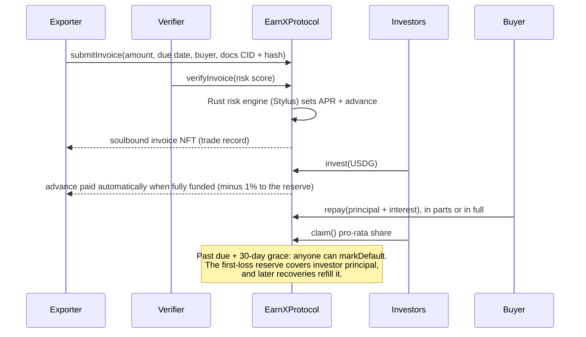

# EarnX

**Get paid when you ship, not when your buyer pays.**

EarnX turns a verified export invoice into cash for an African exporter today. Investors anywhere fund it in **Paxos USDG** (or Circle USDC) and earn the yield when the buyer pays. Everything that moves money is enforced by smart contracts on **Robinhood Chain** and **Arbitrum**.

**[Live app → earnx-app.vercel.app](https://earnx-app.vercel.app)** · [Contracts](contracts/) · [Robinhood Chain protocol](https://explorer.testnet.chain.robinhood.com/address/0xA7fC55ca10c05aA2a0e0Cef5e00f15B08Caf4a99) · [Arbitrum Sepolia protocol](https://arbitrum-sepolia.blockscout.com/address/0x0D0C0eE2a93D4E6d912da43810Ca8f327BDc7341)

---

## The problem

A confirmed export order is not cash. An exporter pays farmers, processors and freight up front, then waits weeks or months for the buyer to pay. Banks rarely lend against those invoices, so good orders are turned down, or sold to middlemen at a discount.

- **$74–92 billion** of trade finance requested by African businesses went unmet in 2024 ([African Development Bank](https://www.gtreview.com/news/africa/africas-trade-finance-gap-tops-us74bn-as-banks-retreat-afdb-warns/)).
- **37%** of trade finance applications from African firms were rejected between 2020 and 2024 (same source).
- Africa's factoring market was about **€50 billion** in 2024; Afreximbank estimates it must reach **€240 billion** to close the SME gap ([Afreximbank via GTR](https://www.gtreview.com/news/africa/factoring-volumes-must-reach-e240bn-to-close-sme-financing-gap-afreximbank-says/)).

## Why I'm building EarnX


My mother, Mama Dora, is a farmer in Delta State, Nigeria. She grows cassava and other crops, and for as long as I can remember her harvest has paid for everything in our home.

Then my father had a stroke. The hospital needed money that week. Like most Nigerian families, we had no health insurance: of every ₦1,000 spent on healthcare in Nigeria, about ₦720 comes straight out of a family's own pocket ([World Bank](https://data.worldbank.org/indicator/SH.XPD.OOPC.CH.ZS?locations=NG)).

It happened just after harvest, when a farmer has the most to show and the least cash in hand. What money she had went to the farmhands who had helped bring the crop in, and it still wasn't enough to pay them all. The harvest was worth far more than the hospital bill, but it wasn't money yet.

So we did what farming families across Africa do. We sold part of the crop cheaply, just to get cash quickly, and we went to the bank. Between the fees and the interest rate, the loan cost far more than we could carry, and it bankrupted us.

I built EarnX so that the value of work already done reaches people when they need it, at a fair price. We start with African exporters, whose invoices we can verify on-chain today. Every invoice we fund is a family that doesn't have to choose between the harvest and the hospital.

*— Godswill Idolor, founder, and son of a Delta State farmer*

<br clear="right" />

## What EarnX does

**For exporters**
- Sign in with a fingerprint or Face ID (a passkey smart account). No wallet app, no seed phrase, and network fees are sponsored.
- Upload the invoice and shipping documents. They go to IPFS; their fingerprint goes on-chain.
- Once verified and fully funded, up to 90% of the invoice lands in your account **in the same transaction**.
- Every verified invoice mints a **non-transferable record** to you: an on-chain trade history that belongs to you, not to a bank's filing cabinet.

**For investors**
- Browse real invoices with their terms, risk score and documents, without connecting a wallet.
- Fund any amount from 1 USDG. When the buyer pays, claim your share of principal plus yield.
- Check for yourself that an invoice's documents still match what the verifier reviewed: the app hashes them in your browser and compares with the chain.

## How it works



**What keeps it honest**
- **Short and self-liquidating.** Each advance is tied to one shipment and repaid when that buyer pays. Terms are capped at 365 days on-chain.
- **First-loss reserve.** 1% of every advance, plus any capital partners add, covers investor principal before investors lose anything. It can only be used for that.
- **Documents you can check.** Each invoice stores the keccak256 of a manifest listing every document and its own hash. A verifier signature is bound to that exact hash.
- **Know who stands behind it.** Exporters who haven't verified their business are approved automatically only up to $1,000 per invoice. Verification is an on-chain registry (`VERIFIED_EXPORTER_ROLE` on the protocol), granted after a reviewer checks the business against its national registry; the request is encrypted before it is stored.
- **The buyer confirms the debt.** Above $1,000 the buyer must sign a statement built from the invoice's on-chain facts: they ordered the goods, the invoice is genuine, and they will pay the EarnX contract. Wallet and passkey signatures (ERC-1271 / ERC-6492) are checked and the signed statement is pinned to IPFS for anyone to re-check. A confirmed buyer or a verified business also lowers the risk score, and so the price.
- **No double financing.** The pre-screen rejects an invoice that reuses any document, the same bundle, or the same invoice number for the same buyer on either chain.
- **Over-invoicing is caught.** Unit prices are compared with World Bank commodity benchmarks; far above market is rejected.
- **No hidden levers.** The admin can pause new activity and allow-list stablecoins. It cannot move investor funds.

## Try it

1. Open **[earnx-app.vercel.app](https://earnx-app.vercel.app)** and pick a network (Robinhood Chain or Arbitrum).
2. Browse **Invest**. Invoices marked *sample* are fictional and seeded for the demo; invoice #6 on each chain has already gone through the whole cycle to **Repaid**.
3. To fund one, get testnet ETH ([Robinhood](https://faucet.testnet.chain.robinhood.com), [Arbitrum](https://arbitrum.faucet.dev)) and test [USDG](https://faucet.paxos.com) or [USDC](https://faucet.circle.com), connect a wallet and invest from 1 USDG.
4. To see the exporter side, go to **Get paid early**, sign in with a passkey or wallet, upload a PDF and submit. The automated pre-screen checks the documents and opens the invoice for funding within seconds.

## Deployments

| Network | EarnXProtocol | EarnXInvoiceNFT | Settlement |
|---|---|---|---|
| Robinhood Chain testnet (46630) | [`0xA7fC55ca10c05aA2a0e0Cef5e00f15B08Caf4a99`](https://explorer.testnet.chain.robinhood.com/address/0xA7fC55ca10c05aA2a0e0Cef5e00f15B08Caf4a99) | [`0x7c2e27323578C67B4c2E847024D80091586503d6`](https://explorer.testnet.chain.robinhood.com/address/0x7c2e27323578C67B4c2E847024D80091586503d6) | Paxos USDG |
| Arbitrum Sepolia (421614) | [`0x0D0C0eE2a93D4E6d912da43810Ca8f327BDc7341`](https://arbitrum-sepolia.blockscout.com/address/0x0D0C0eE2a93D4E6d912da43810Ca8f327BDc7341) | [`0xc9A10EDA07ea8D90dB95254540efb7F00907f888`](https://arbitrum-sepolia.blockscout.com/address/0xc9A10EDA07ea8D90dB95254540efb7F00907f888) | Paxos USDG, Circle USDC |

Rust risk engine (Stylus): Robinhood Chain [`0x454aeA0eDA332a09FFc61C5799B336AEa24Cd863`](https://explorer.testnet.chain.robinhood.com/address/0x454aeA0eDA332a09FFc61C5799B336AEa24Cd863) · Arbitrum Sepolia [`0xb78d4d4FDCBd5e2E73405091138B08bd1707d551`](https://arbitrum-sepolia.blockscout.com/address/0xb78d4d4FDCBd5e2E73405091138B08bd1707d551)

The Solidity contracts are source-verified on Blockscout.

## Architecture

| Part | What it is |
|---|---|
| [`contracts/`](contracts/) | Foundry project. `EarnXProtocol` (lifecycle, pricing, reserve) and `EarnXInvoiceNFT` (ERC-5192 soulbound records with on-chain SVG metadata). OpenZeppelin 5.7: AccessControl, SafeERC20, ReentrancyGuard, Pausable, EIP-712, Nonces. 29 tests including fuzz tests; CI on every push. |
| [`contracts/stylus/risk-engine`](contracts/stylus/risk-engine) | **Rust risk engine on Arbitrum Stylus.** Prices every invoice on-chain from a published formula: APR = 8% + 0.15% per risk point + term and size premiums; advance = 90%, reduced for higher risk and long terms. No storage, no owner; 4.3 KB of WASM with Rust unit tests. |
| [`app/`](app/) | Vite + React + TypeScript, wagmi + RainbowKit for wallets, ZeroDev Kernel v3.1 for passkey accounts with sponsored gas, Tailwind. ABIs and addresses are generated from `contracts/` so the app cannot drift from the chain. |
| [`app/api/upload`](app/api/upload.ts) | Serverless function that pins documents to IPFS through Pinata and returns the manifest CID and hash. The Pinata key never reaches the browser. |
| [`app/api/verify`](app/api/verify.ts) | Automated pre-screen for the testnet: re-fetches the documents from IPFS, checks them against the on-chain hash, the market price and every invoice on both chains for duplicates, applies the business-verification limit and buyer-confirmation rule, then verifies or rejects the invoice with a key that holds `VERIFIER_ROLE` and nothing else. |
| [`app/api/confirm`](app/api/confirm.ts) | Buyer confirmation: serves the statement for an invoice, checks the buyer's signature (EOA, ERC-1271 or ERC-6492) and pins the signed statement to IPFS, indexed by invoice. |
| [`app/api/kyb`](app/api/kyb.ts) | Business verification requests, encrypted with AES-256-GCM before they are pinned. [`app/scripts/kyb-requests.mjs`](app/scripts/kyb-requests.mjs) decrypts them for the reviewer and prints the on-chain command that records the result. |

**Why Robinhood Chain and Arbitrum.** Both are Arbitrum chains with low fees and fast blocks. Robinhood Chain is built for real-world assets and has USDG natively; Arbitrum has deep stablecoin liquidity and native USDC. The same contracts run on both.

## Built during the Arbitrum Open House Singapore buildathon

Everything before the buildathon is tagged [`pre-buildathon`](https://github.com/big14way/earnx/tree/pre-buildathon) (an earlier Mantle Sepolia version). **[See every change since →](https://github.com/big14way/earnx/compare/pre-buildathon...main)**

During the buildathon we:
- rewrote the contracts from scratch: the previous contract accepted deposits but had no payout, repayment or claim path, and approved every invoice automatically;
- added the first-loss reserve, EIP-712 verifier signatures bound to document hashes, and soulbound trade records;
- wrote a risk engine in Rust on Arbitrum Stylus that prices every new invoice on-chain, and plugged it into the protocol on both chains;
- wrote the test suite and CI, then deployed and verified on Robinhood Chain testnet and Arbitrum Sepolia with Paxos USDG;
- rebuilt the app around live on-chain data (the old one showed hardcoded figures), added passkey accounts with sponsored gas, IPFS uploads and the automated verifier;
- added the trust layer: tiered limits from an on-chain business-verification registry, signed buyer confirmations, a cross-chain duplicate check, and a World Bank market-price check;
- removed hardcoded credentials and the unused Morph/Mantle-era code.

## Security and limitations

- **Testnet only.** The contracts are not audited. Do not use real funds.
- **Verification is the trust point.** On the testnet an automated pre-screen approves small invoices from unverified exporters and larger ones only with a verified business and the buyer's signature. Business checks are manual today; before mainnet they move to a licensed identity partner, and buyer contacts are verified independently of the exporter (today a buyer is whoever holds the account that signs). The contract already accepts any approved verifier, including signed approvals from off-chain reviewers.
- **Repayment depends on the buyer.** The reserve softens defaults but cannot remove them. Default rates and reserve levels are shown publicly in the app.

## Run it locally

```bash
git clone --recurse-submodules https://github.com/big14way/earnx.git && cd earnx

# contracts (needs Foundry)
cd contracts && forge test && cd ..

# app
cd app && npm install && cp .env.example .env.local   # add a Reown project ID (and ZeroDev for passkeys)
npm run dev
```

Deployment scripts and the sample-invoice seeder are documented in [`contracts/README.md`](contracts/README.md).

## License

[MIT](LICENSE)
